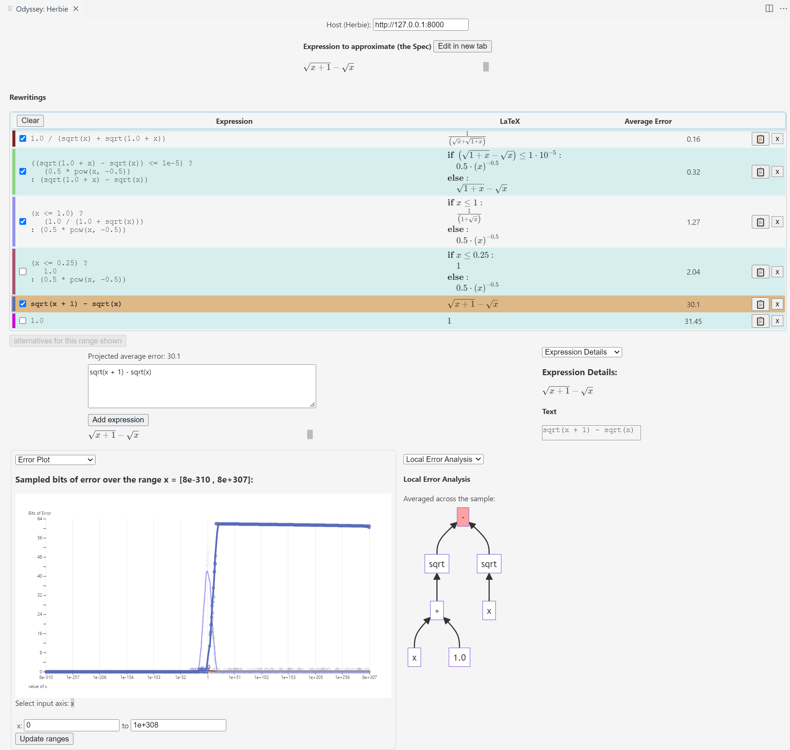

# Odyssey: An Interactive Numerics Workbench

Odyssey is a VSCode extension developed to enhance the interactivity of floating-point error investigation and improvement systems like the [Herbie](https://herbie.uwplse.org/demo/) tool.

Odyssey is designed to help users identify sources of error in floating-point expressions and then rewrite the expressions to improve their accuracy. It includes analyses of local error for particular inputs as well as a plot of error across a uniform sample of possible inputs for a floating-point expresssion, and uses Herbie to generate rewrite suggestions.

## Running Odyssey

### Herbie server
<!-- TODO update to point to binary DL? -->
A running instance of Herbie must be present before analyzing an expression with Odyssey. After following the [Herbie installation instructions](https://herbie.uwplse.org/doc/latest/installing.html), you can run a Herbie server with
```
herbie web --port 8000 --quiet
```
You can adjust the server address where Odyssey looks for Herbie in the Odyssey interface.
<!-- TODO picture? maybe not needed -->

### Starting Odyssey

After starting the Herbie server, run Odyssey from the VSCode command palette using Ctrl/Command-Shift-P > "Odyssey: Herbie".

## Tutorial
<!-- TODO update with current interface, more detailed tutorial -->
Here is a 5-minute demo (from an earlier interface) describing Odyssey's purpose, current capabilities, and goals (usage demo starts at 1:02):
<iframe width="672" height="378" src="https://www.youtube.com/embed/VQnHE7Kzoto?t=62" title="Odyssey" frameborder="0" allow="accelerometer; autoplay; clipboard-write; encrypted-media; gyroscope; picture-in-picture; web-share" allowfullscreen></iframe>

## Features



<!-- > Tip: Many popular extensions utilize animations. This is an excellent way to show off your extension! We recommend short, focused animations that are easy to follow. -->


# Setting up a development environment
```bash
$ npm install  # make sure this runs to completion!
# TODO update these notes
# Then use command/control+shift+B to start the auto-compile tasks (might have to rerun the first time...)
# Each time compilation finishes, you should see a message like "created out/webview/bundle.js in 2.5s"
```

### Testing the extension
Use the "Run and Debug" tab to start an instance of VSCode with the most recent code.

You can see changes to the frontend (`webview/index.ts`) by simply refreshing the webview, but changes to the host (`extension.ts`) will only show if the debugger is restarted.

### How to publish:

Get publication key from @elmisback, then:

```bash
# update "version" in package.json, then
$ npm run publish
```

<!-- ## Extension Settings

Include if your extension adds any VS Code settings through the `contributes.configuration` extension point.

For example:

This extension contributes the following settings:

* `myExtension.enable`: enable/disable this extension
* `myExtension.thing`: set to `blah` to do something -->

## Known Issues

See the issues tab on Github.

## Release Notes

Users appreciate release notes as you update your extension.

### 0.1.0

First major post-study 1 version

-----------------------------------------------------------------------------------------------------------
<!-- ## Following extension guidelines

Ensure that you've read through the extensions guidelines and follow the best practices for creating your extension.

* [Extension Guidelines](https://code.visualstudio.com/api/references/extension-guidelines)

## Working with Markdown

**Note:** You can author your README using Visual Studio Code.  Here are some useful editor keyboard shortcuts:

* Split the editor (`Cmd+\` on macOS or `Ctrl+\` on Windows and Linux)
* Toggle preview (`Shift+CMD+V` on macOS or `Shift+Ctrl+V` on Windows and Linux)
* Press `Ctrl+Space` (Windows, Linux, macOS) to see a list of Markdown snippets

### For more information

* [Visual Studio Code's Markdown Support](http://code.visualstudio.com/docs/languages/markdown)
* [Markdown Syntax Reference](https://help.github.com/articles/markdown-basics/) -->
