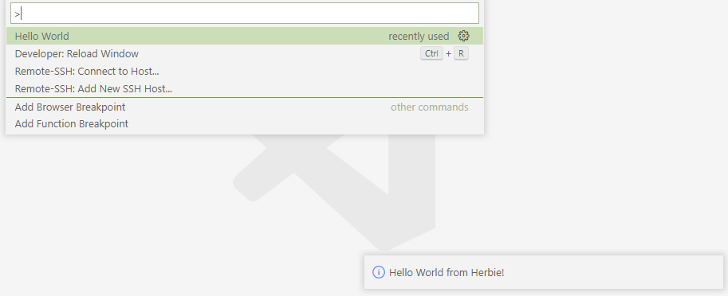

# interactive-herbie README

### Setting up a development environment
```bash
$ npm install  # make sure this runs to completion!
# Then use command/control+shift+B to start the auto-compile tasks
# Each time compilation finishes, you should see a message like "created out/webview/bundle.js in 2.5s"
```

### Testing the extension
Use the "Run and Debug" tab to start an instance of VSCode with the most recent code.

You can see changes to the frontend (`webview/index.ts`) by simply refreshing the webview, but changes to the host (`extension.ts`) will only show if the debugger is restarted.

### How to publish:

```bash
# update "version" in package.json, then
$ npm run publish
```

## Features

Describe specific features of your extension including screenshots of your extension in action. Image paths are relative to this README file.

For example if there is an image subfolder under your extension project workspace:



> Tip: Many popular extensions utilize animations. This is an excellent way to show off your extension! We recommend short, focused animations that are easy to follow.

## Requirements

(Mandatory README edit for publication.)


If you have any requirements or dependencies, add a section describing those and how to install and configure them.

## Extension Settings

(Mandatory README edit for publication.)


Include if your extension adds any VS Code settings through the `contributes.configuration` extension point.

For example:

This extension contributes the following settings:

* `myExtension.enable`: enable/disable this extension
* `myExtension.thing`: set to `blah` to do something

## Known Issues

(Mandatory README edit for publication.)


Calling out known issues can help limit users opening duplicate issues against your extension.

## Release Notes

(Mandatory README edit for publication.)


Users appreciate release notes as you update your extension.

### 1.0.0

Initial release of ...

### 1.0.1

Fixed issue #.

### 1.1.0

Added features X, Y, and Z.

-----------------------------------------------------------------------------------------------------------
## Following extension guidelines

Ensure that you've read through the extensions guidelines and follow the best practices for creating your extension.

* [Extension Guidelines](https://code.visualstudio.com/api/references/extension-guidelines)

## Working with Markdown

**Note:** You can author your README using Visual Studio Code.  Here are some useful editor keyboard shortcuts:

* Split the editor (`Cmd+\` on macOS or `Ctrl+\` on Windows and Linux)
* Toggle preview (`Shift+CMD+V` on macOS or `Shift+Ctrl+V` on Windows and Linux)
* Press `Ctrl+Space` (Windows, Linux, macOS) to see a list of Markdown snippets

### For more information

* [Visual Studio Code's Markdown Support](http://code.visualstudio.com/docs/languages/markdown)
* [Markdown Syntax Reference](https://help.github.com/articles/markdown-basics/)
