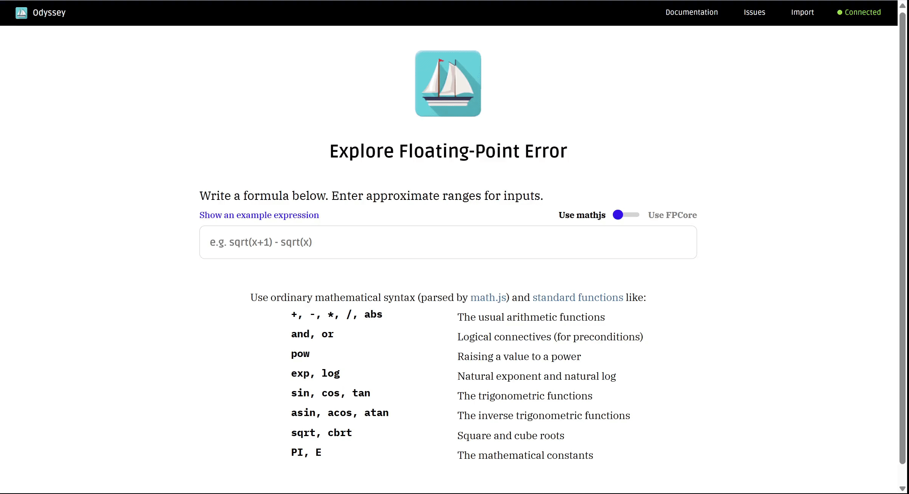
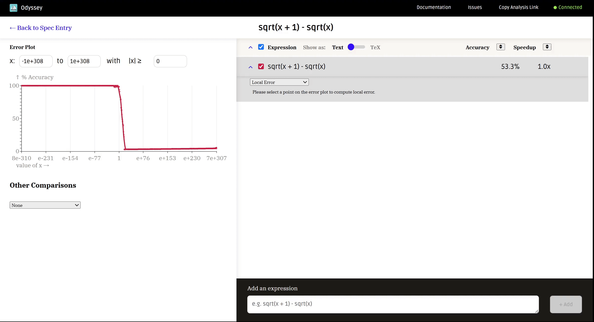
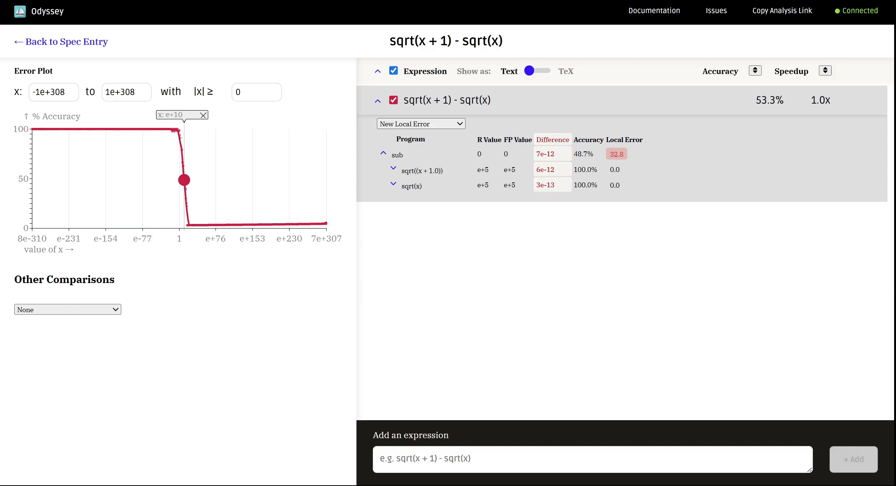
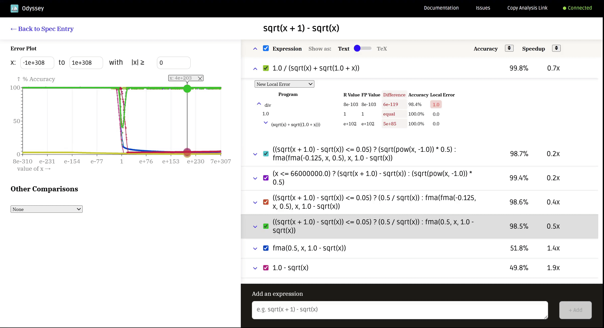
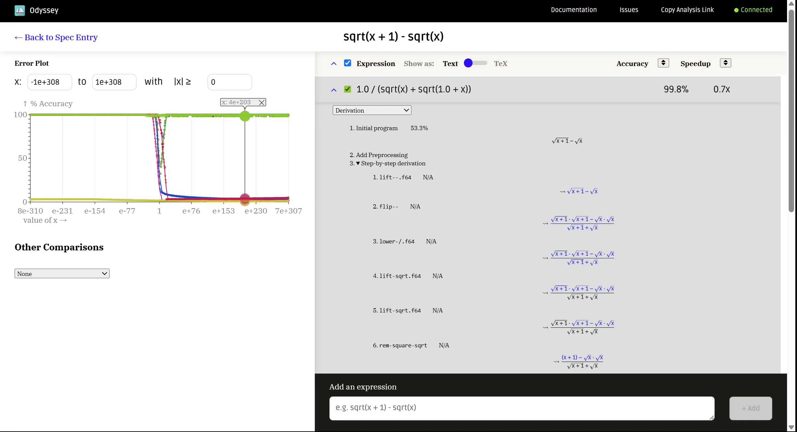
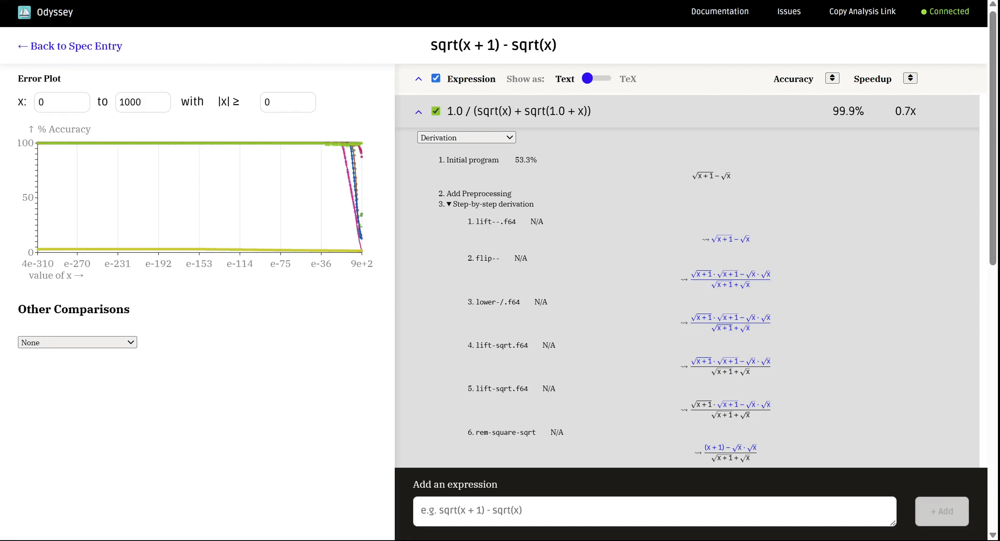

# Odyssey: An Interactive Numerics Workbench 
#### [[Video tutorial (8.5 min)]](https://youtu.be/jsjGuM2KK50) [[Setup]](#running-odyssey)

Odyssey is a tool for interactively rewriting numerical expressions to reduce floating-point error.


<br>
<br>

**Before using Odyssey, please see [Running Odyssey](#running-odyssey) below to install dependencies.**

## Table of Contents
- [Features](#features)
- [Running Odyssey](#running-odyssey)
- [Submitting Feedback and Getting Help](#submitting-feedback-and-getting-help)
- [Release Notes](#release-notes)
- [For Developers](#for-developers)

## Features

Odyssey displays the *local error* of expressions. Local error shows how different subexpressions contribute to the total error for an input.


<br>
<br>

Odyssey generates rewriting suggestions with the state-of-the-art [Herbie](https://herbie.uwplse.org/demo/) floating-point expression rewriting tool.


<br>
<br>

Derivations of Herbie's rewrites are also available.


<br>
<br>

The sample range of the expression can be adjusted to fit your use case.

<!-- TODO gif of Odyssey showing adjusting the sample range for sqrt(x + 1) - sqrt(x) -->

<br>
<br>

A sharable link that contains Odyssey's state can be generated. 


<br>
<br>

A full walkthrough of Odyssey is available in the [video tutorial](https://youtu.be/jsjGuM2KK50). 

If you have any questions about features, please [open an issue](https://github.com/herbie-fp/odyssey/issues/new) on Github.

## Running Odyssey

Odyssey runs as a VSCode extension. You can install it from the VSCode Marketplace [here](https://marketplace.visualstudio.com/items?itemName=herbie-fp.odyssey-fp), but first follow the instructions below to install dependencies. 

### Dependencies
Odyssey uses a [Herbie](https://herbie.uwplse.org) server to analyze expressions and currently requires you to bring your own Herbie instance. After following the [Herbie installation instructions](https://herbie.uwplse.org/doc/latest/installing.html), you can run a Herbie server with
```bash
$ herbie web --port 8000 --quiet
# Response should look like:
Herbie 2.0 with seed 552322303
Find help on https://herbie.uwplse.org/, exit with Ctrl-C
Your Web application is running at http://localhost:8000.
Stop this program at any time to terminate the Web Server.
```

### Running the VSCode extension

After starting the Herbie server, run Odyssey from the VSCode command palette by clicking on VSCode and using **Ctrl/Command-Shift-P > Odyssey: Herbie.**

The server status shown in Odyssey should have the text "Connected."

If the server status is red with the text "No Server", Odyssey can't connect to the Herbie server.

If needed, you can adjust the server address where Odyssey looks for Herbie by clicking on the server status. Make sure that the port Odyssey is connecting to is the same one Herbie is being hosted on.

### (Alternative) Running as a standalone web application

Odyssey can also run as a standalone web application.

First, you'll need to install node from https://nodejs.org/en/download/.

Next, clone this repo and build the application:
```bash
$ git clone https://github.com/herbie-fp/odyssey
$ cd odyssey
$ npm install
$ npm run compile
```

Then, after starting the Herbie server, run an HTTP server to serve the `index.html` file:
```bash
$ npx serve -p 3000
```

# Submitting Feedback and Getting Help
Please submit any feedback or bug reports by [opening an issue on this repo](https://github.com/herbie-fp/odyssey/issues/new).

# Release Notes

### 1.0.0
* First public release

<!-- TODO add more release notes -->

### 0.4.0

* Rename repo + extension
* Still unofficial; expecting to release 1.0 at the beginning of August

### 0.1.0

First major post-study 1 version

# For Developers

## Setting up a development environment
```bash
$ npm install
# Then use command/control+shift+B to start the auto-compile task
# Each time compilation finishes, you should see a message like "webpack 5.82.1 compiled with 1 warning in 31769 ms"
```

### Testing the extension
Use the "Run and Debug" tab to start an instance of VSCode with the most recent code.

You can see changes to the frontend (`webview/index.ts`) by simply refreshing the webview, but **changes to the host (`extension.ts`) will only show if the debugger is restarted.**

To run the test suite, see the documentation in `doc/test_suite.md`.

### Publishing the extension:

Get publication key from @elmisback, then:

```bash
# update "version" in package.json and commit, then
$ npm run publish
```

<!-- ## Extension Settings

Include if your extension adds any VS Code settings through the `contributes.configuration` extension point.

For example:

This extension contributes the following settings:

* `myExtension.enable`: enable/disable this extension
* `myExtension.thing`: set to `blah` to do something -->

-----------------------------------------------------------------------------------------------------------
<!-- ## Following extension guidelines

Ensure that you've read through the extensions guidelines and follow the best practices for creating your extension.

* [Extension Guidelines](https://code.visualstudio.com/api/references/extension-guidelines)

-->

## Acknowledgements

This material is based upon work supported by the National Science Foundation under Grant No. CNS-2346394.

